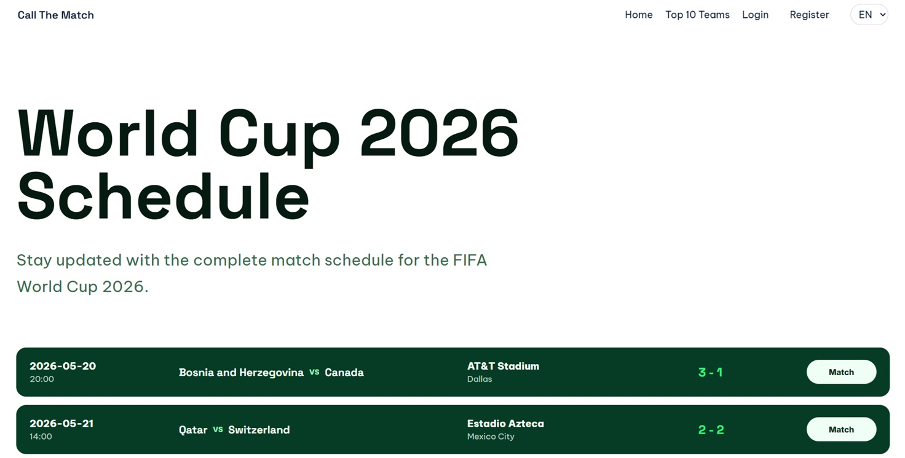

# Getting Started

Call The Match is a Spring Boot application where users predict FIFA World Cup 2026 match results and compete with friends in teams.



## Context for this project

This project was built to learn how to setup my own agentic workflow for building web applications. The workflow is based on the "shift left" concept: instead of writing documentation at the end, documentation is created first and used as the source of truth for planning, implementation and verification.

In this first step, the project guidelines are defined. They describe what good and bad code looks like in the context of this project, so the agent has concrete examples instead of vague preferences. 
They explain how the Spring Boot layers interact: controllers receive requests and prepare the model or redirect flow, services coordinate the application logic, repositories isolate database access and DTOs define the data that enters or leaves a layer. Further it also documents how validation, i18n messages, exception handling, security rules, role access and tests should be handled. 
Finally, they point the agent to the files and folders it should consult first, such as the current codebase, school guidelines, lesson notes, exercise projects, PRDs and plans, so every implementation decision starts from the same context.

This unfolded into a set of skill files that guide the agent through the development process.

## Pipeline Overview

The skill files form a documentation-first pipeline for agentic Spring Boot development:

```markdown
1. project-guidelines   -> Defines school conventions and project rules
2. write-a-prd          -> Creates a feature PRD before implementation
3. prd-to-plan          -> Converts the PRD into vertical implementation slices
4. prd-to-plan-json     -> Converts the plan into structured Ralph tasks
5. ralph-init           -> Scaffolds the loop scripts, prompts and progress files
6. Ralph loop (runtime) -> Iteratively implements and verifies tasks from plan.json
7. diagnose/prototype   -> Supports debugging or design exploration when needed
8. handoff              -> Captures context for a future agent or session
```

Supporting skills:

- `project-guidelines` - referenced by all planning and implementation stages for the project conventions.
- `grill-me` - used to stress-test plans and decisions before implementation.
- `frontend-design` - used when a Thymeleaf screen needs visual design or UI refinement.
- `diagnose` - used when a bug needs a structured reproduction and debugging loop.
- `prototype` - used when a design or logic question needs a throwaway experiment first.
- `handoff` - used to transfer context to another agent or future session.

---

## Skill Files

The `.agents/skills/` directory contains instruction files that guide AI agents through the different stages of the development pipeline. Each skill is a standalone folder with a `SKILL.md` file containing frontmatter metadata (`name`, `description`) and detailed step-by-step instructions.

### Project Guidelines

The foundational skill file for this repository. Every planning or coding step should follow it. It defines:

- **Source order**: first inspect the current codebase, then use the school guidelines, lesson notes and exercise projects before relying on generic Spring Boot advice.
- **Project rules**: email login, registered users get role `USER`, admins manage matches only, users manage teams and predictions, guests can see public pages.
- **Architecture**: controllers stay thin, services coordinate repositories, business logic does not belong in Thymeleaf views, and repository calls do not belong in controllers.
- **Validation and i18n**: form input uses DTOs, `BindingResult`, validation annotations, custom validators where needed and resource bundle messages.
- **Security**: guest/user/admin boundaries must stay explicit, and admin must not be treated as a normal prediction or team participant.
- **Testing**: required test categories include MVC controller tests, REST controller tests, security tests and validation tests.

---

### Write A PRD

Creates or revises a Product Requirements Document for one feature at a time. PRDs are stored in `src/main/resources/prd/{feature-name}-prd.md`.

- **Purpose**: define the feature before coding starts.
- **Inputs**: current codebase, FIFA assignment, school guidelines, notes, exercise projects and user decisions.
- **Output**: a Markdown PRD with problem statement, solution, role/access decisions, user stories, implementation decisions, testing decisions, REST/WebClient scope and sources.
- **Important rule**: do not create one large master PRD unless explicitly requested. The workflow prefers feature-level PRDs.
- **Why it matters**: later skills use the PRD as source material, so the PRD becomes the first durable planning artifact.

---

### PRD To Plan

Turns a feature PRD into a phased Markdown implementation plan under `src/main/resources/prd/{feature-name}/plan.md`.

- **Planning style**: uses vertical slices, also called tracer bullets, instead of broad horizontal phases.
- **Each phase covers**: the relevant MVC/Thymeleaf, service, repository, DTO, validation, security, i18n, REST/WebClient and test boundaries.
- **Approval step**: the agent proposes the phase breakdown before writing or replacing a plan.
- **Output**: a plan with architectural decisions, phases and acceptance criteria.
- **Why it matters**: it translates the PRD into an implementation order that can be reviewed before task generation.

---

### PRD To Plan JSON

Converts a PRD or approved Markdown plan into a Ralph-compatible task file at `src/main/resources/plan/{feature-name}/plan.json`.

- **Task shape**: each task has an `id`, `title`, `description`, `acceptance_criteria`, `priority` and `passes` flag.
- **Task rules**: tasks must be small, ordered, independently verifiable and concrete enough for an autonomous coding pass.
- **Safety rule**: existing tasks are never rewritten or deleted. New work is appended as follow-up tasks.
- **No e2e sync**: this project verifies work through Java/Spring tests, not Playwright e2e plans.
- **Why it matters**: `plan.json` is the executable checklist used by the Ralph loop.

---

### Ralph Init

Scaffolds the Codex-native Ralph workflow for a feature that already has a `plan.json`.

- **Creates**: `scripts/ralph.ps1`, iteration prompts, `progress.md` and `TODO.md`.
- **Modes**: supports preview, human-in-the-loop runs and AFK runs.
- **Ralph loop**: picks the highest-priority incomplete task, implements it, verifies it and only marks `passes: true` when the acceptance criteria are proven.
- **Progress tracking**: each run records work done, decisions, changed files, verification results and blockers.
- **Why it matters**: it turns planning artifacts into a repeatable implementation loop.

---

### Diagnose

Defines a disciplined bug diagnosis workflow.

- **Core idea**: build a fast, deterministic feedback loop before guessing at fixes.
- **Process**: reproduce, minimize, create hypotheses, instrument, fix, add regression coverage and clean up debug artifacts.
- **Useful for**: broken routes, failing tests, security mistakes, validation edge cases and performance regressions.
- **Why it matters**: it prevents the agent from patching symptoms without understanding the failure.

---

### Frontend Design

Guides the creation or refinement of application UI.

- **Purpose**: make screens feel intentional instead of generic.
- **Used for**: Thymeleaf pages, dashboards, forms, tables, navigation and visual polish.
- **Design stance**: choose a clear visual direction, respect the app context and avoid default-looking layouts.
- **Why it matters**: the project is server-rendered, but the user-facing screens still need thoughtful visual design.

---

### Grill Me

Forces unclear plans or designs through a question-driven review.

- **Purpose**: resolve decisions before implementation.
- **Behavior**: asks direct questions, explores dependencies and recommends answers.
- **Important rule**: if a question can be answered from the codebase, the agent should inspect the code instead of asking the user.
- **Why it matters**: it reduces vague planning and helps avoid expensive wrong assumptions.

---

### Prototype

Creates throwaway experiments before committing to production code.

- **Logic branch**: builds a small terminal prototype for state-machine or business-rule questions.
- **UI branch**: builds multiple visual variants when the question is about layout or interaction.
- **Rules**: prototypes are temporary, clearly marked, easy to run and should be deleted or absorbed once the answer is known.
- **Why it matters**: uncertain design choices can be tested quickly before touching the real implementation.

---

### Handoff

Creates a concise handoff document for another agent or a future session.

- **Purpose**: preserve just enough context to continue work safely.
- **Output**: a temporary handoff document outside the repository.
- **Includes**: current state, relevant artifact paths, suggested skills and next steps.
- **Safety**: avoids duplicating existing PRDs/plans and redacts sensitive information.
- **Why it matters**: long agentic workflows need clean continuation points.

## Technologies & Packages Used

- [Java 21](https://www.oracle.com/java/technologies/downloads/#java21) - Programming language used by the application.
- [Spring Boot](https://spring.io/projects/spring-boot) - Main backend framework.
- [Spring MVC](https://docs.spring.io/spring-framework/reference/web/webmvc.html) - Server-side web controllers and routing.
- [Spring WebFlux](https://docs.spring.io/spring-framework/reference/web/webflux.html) - Web client/reactive web support.
- [Spring Data JPA](https://spring.io/projects/spring-data-jpa) - Repository and persistence abstraction.
- [Spring JDBC](https://docs.spring.io/spring-framework/reference/data-access/jdbc.html) - JDBC database support.
- [Spring Security](https://spring.io/projects/spring-security) - Authentication, authorization and route protection.
- [Thymeleaf](https://www.thymeleaf.org/) - Server-side HTML templating.
- [Thymeleaf Spring Security Extras](https://github.com/thymeleaf/thymeleaf-extras-springsecurity) - Security helpers inside Thymeleaf templates.
- [Jakarta Bean Validation](https://beanvalidation.org/) - DTO and form input validation.
- [MySQL](https://www.mysql.com/) - Relational database used locally.
- [MySQL Connector/J](https://dev.mysql.com/doc/connector-j/en/) - JDBC driver for MySQL.
- [Maven](https://maven.apache.org/) - Build tool and dependency manager.
- [Maven Wrapper](https://maven.apache.org/wrapper/) - Runs the project with the bundled Maven version.
- [Lombok](https://projectlombok.org/) - Reduces Java boilerplate in models, DTOs and services.
- [Datafaker](https://www.datafaker.net/) - Generates local development seed data.
- [JUnit 5](https://junit.org/junit5/) - Test framework.
- [MockMvc](https://docs.spring.io/spring-framework/reference/testing/mockmvc.html) - MVC controller testing.
- [Spring Security Test](https://docs.spring.io/spring-security/reference/servlet/test/index.html) - Security test utilities.

## Project Structure

```text
call-the-match/
|-- .agents/                      Local agent skills and workflows
|-- docs/                         Project documentation
|-- prompts/                      Ralph workflow prompts
|-- scripts/                      Local helper scripts
|-- src/
|   |-- main/
|   |   |-- java/com/example/callthematch/
|   |   |   |-- advice/           MVC and REST exception handling
|   |   |   |-- client/           REST client runner code
|   |   |   |-- config/           Spring, security, locale and seed-data config
|   |   |   |-- controller/       MVC controllers
|   |   |   |-- dto/              Request and response DTOs
|   |   |   |-- exception/        Custom application exceptions
|   |   |   |-- formatter/        Formatting helpers
|   |   |   |-- model/            JPA entities and enums
|   |   |   |-- repository/       Spring Data repositories
|   |   |   |-- service/          Business logic
|   |   |   `-- validator/        Custom validation rules
|   |   `-- resources/
|   |       |-- audit/            Audit notes and project checks
|   |       |-- handoff/          Saved handoff notes
|   |       |-- i18n/             Translation bundles
|   |       |-- plan/             Ralph task plans
|   |       |-- prd/              Feature PRDs and Markdown plans
|   |       |-- ralph/            Ralph progress logs and TODO files
|   |       |-- static/           CSS and JavaScript assets
|   |       |-- templates/        Thymeleaf views
|   |       `-- application.properties
|   `-- test/
|       |-- java/com/example/callthematch/
|       |   |-- controller/       MVC tests
|       |   |-- restcontroller/   REST controller tests
|       |   |-- security/         Route and role tests
|       |   |-- service/          Service tests
|       |   |-- support/          Test data helpers
|       |   `-- validation/       DTO and validator tests
|       `-- resources/
|           `-- application.properties
```


## Installation Instructions

### Running the App

Start application on Windows:

```bash
.\mvnw.cmd spring-boot:run
```

Open the application at:

```bash
http://localhost:8080
```

Build application:

```bash
.\mvnw.cmd clean package
```

Run tests:

```bash
.\mvnw.cmd test
```

Run one test class:

```bash
.\mvnw.cmd -Dtest=CompetitionControllerTests test
```
## Environment Variables

The default local configuration lives in `src/main/resources/application.properties`.

Default config:

```properties
spring.application.name=call-the-match
spring.messages.basename=i18n/messages
spring.messages.fallback-to-system-locale=false

spring.datasource.url=jdbc:mysql://localhost:3306/callthematch?useUnicode=true&useJDBCCompliantTimezoneShift=true&useLegacyDatetimeCode=false&serverTimezone=UTC
spring.datasource.username=
spring.datasource.password=
spring.datasource.driver-class-name=com.mysql.cj.jdbc.Driver

spring.jpa.hibernate.ddl-auto=create-drop
spring.profiles.active=dev
```

You can override Spring properties with environment variables if your local database uses different credentials:

```bash
SPRING_DATASOURCE_URL=jdbc:mysql://localhost:3306/callthematch
SPRING_DATASOURCE_USERNAME=root
SPRING_DATASOURCE_PASSWORD=rootpassword
SPRING_PROFILES_ACTIVE=dev
```

## Seed Data

The `dev` profile runs `InitDataConfig` and seeds the database on startup.

Useful seeded accounts:

```bash
admin@example.com / password
user1@example.com / password
user2@example.com / password
```

The seed data also creates countries, stadiums, competitions, teams and team members for local development.
